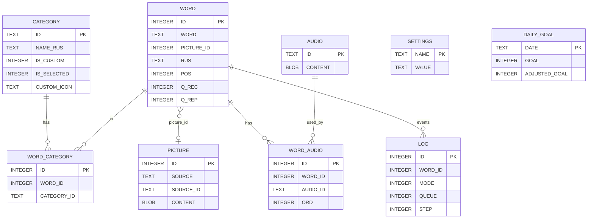

# Схема бэкапа Reword (`.backup`)

Файл `reword_en.backup` — это обычная **SQLite 3**, не архив.
В VocabDesk он читается через `sql.js` (`src/db/rewordDb.ts`).

Проверено на дампе от 30.08.2026:

| | |
|---|---|
| Размер | 30 482 432 байт (ровно `page_count × page_size`) |
| `page_size` | 4096 |
| `page_count` | 7442 |
| Кодировка | UTF-8 |
| `user_version` | **115** (версия схемы приложения Reword) |
| `application_id` | 0 |
| Formal FK | нет (`PRAGMA foreign_keys = 0`, в DDL тоже нет `FOREIGN KEY`) |
| Locale | `android_metadata.locale = ru_RU` |

Открыть локально:

```bash
sqlite3 reword_en.backup ".schema"
```

---

## Общая картина

```
CATEGORY (словари / тематики)
    │
    │  N:M через WORD_CATEGORY
    ▼
WORD ──────────── PICTURE          (WORD.PICTURE_ID → PICTURE.ID, необязательно)
    │
    │  1:N через WORD_AUDIO
    ▼
AUDIO

WORD ──1:N── LOG          (история ответов)
SETTINGS                  (ключ/значение, настройки приложения)
DAILY_GOAL                (дневная норма по датам)
android_metadata          (служебная таблица Android Room/SQLite)
```

Связи только логические: приложение само джойнит по ID. Сирот в этом дампе нет.

Два независимых «направления» карточки (в этом файле значения **всегда совпадают**):

- **REC** — recognition (узнавание: перевод → слово)
- **REP** — reproduction (воспроизведение: слово → перевод)

Настройки дампа: `word_learning_card_mode = reproduction`, `word_review_card_mode = reproduction`.

---

## Таблицы и объёмы этого дампа

| Таблица | Строк | Роль |
|---|---:|---|
| `WORD` | 11 852 | Словарная единица (слово + переводы + SRS) |
| `CATEGORY` | 64 | Словари / тематики |
| `WORD_CATEGORY` | 18 172 | Слово ↔ словарь (N:M) |
| `PICTURE` | 3 845 | Картинки (часто без блоба, только ссылка) |
| `AUDIO` | 11 227 | Аудиофайлы (часто без блоба, только имя) |
| `WORD_AUDIO` | 13 078 | Слово ↔ несколько озвучек |
| `LOG` | 7 056 | Журнал ответов |
| `DAILY_GOAL` | 180 | Норма на день (`2022-12-20` … `2026-03-04`) |
| `SETTINGS` | 34 | Настройки клиента Reword |
| `android_metadata` | 1 | `ru_RU` |

ID в `WORD` идут с пропусками: `MIN=1`, `MAX=11895`, строк 11852 (43 дырки). То же у `PICTURE` / `WORD_CATEGORY` / `WORD_AUDIO`.

---

## ER (логические ключи)



---

## `CATEGORY` — словари

```sql
ID TEXT PRIMARY KEY NOT NULL
NAME_RUS / NAME_TUR / NAME_KOR / NAME_ARA / NAME_SPA / NAME_POR /
NAME_ITA / NAME_DEU / NAME_FRA / NAME_UKR / NAME_JPN / NAME_ZHS / NAME_ZHT
IS_CUSTOM INTEGER NOT NULL          -- 0 = каталог Reword, 1 = пользовательский
IS_SELECTED INTEGER NOT NULL        -- 1 = входит в «выбранные» (учёба по умолчанию)
CUSTOM_ICON TEXT                    -- ключ иконки; у каталога почти всегда NULL
REG INTEGER                         -- регион; в этом дампе везде NULL
```

Имена на других языках заполнены частично (RUS — все 64, ITA 52, DEU 37, … ARA/POR/ZHS/ZHT — 0).
VocabDesk берёт только `NAME_RUS`.

### Типы ID

| Вид | Пример | Смысл |
|---|---|---|
| slug | `oxford3000_a1`, `food`, `phrasal_verbs` | Встроенный словарь Reword |
| `custom` | `custom` | Служебный список «Повторение знакомых слов» |
| hex 32 | `605E809001B209ACD7DFE1DC9D30D9A2` | Пользовательский список (похоже на MD5) |

`CUSTOM_ICON` у пользовательских: `book`, `advanced_words`, `custom`.
У каталога поле пустое — иконки в мобильном клиенте зашиты по ID (см. `src/lib/categoryIcons.ts`).

### Словари в этом дампе

**Выбраны (`IS_SELECTED=1`)** — 5 шт., 4237 уникальных слов (с пересечениями):

| ID | Название | Слов |
|---|---|---:|
| `oxford3000_a1` | Oxford 3000 - A1 | 965 |
| `oxford3000_a2` | Oxford 3000 - A2 | 894 |
| `oxford3000_b1` | Oxford 3000 - B1 | 850 |
| `oxford3000_b2` | Oxford 3000 - B2 | 797 |
| `oxford5000_b2` | Oxford 5000 - B2 | 734 |

**Каталог Reword** (ещё 56, `IS_CUSTOM=0`): тематики (`food`, `business`, …), частотные (`top100` / `top1000` / `top3000` = NGSL), `oxford5000_c1`, `idioms`, `phrasal_verbs`, `irregular_verbs`, `advanced_words`, `basic_verbs`.

**Пользовательские** (`IS_CUSTOM=1`):

| ID | Название | `CUSTOM_ICON` | Слов |
|---|---|---|---:|
| `52F265A7AC9355A9A5118CF8882E5E89` | Мой список популярных слов | `book` | 1 |
| `605E809001B209ACD7DFE1DC9D30D9A2` | Повторение выученных слов | `advanced_words` | 163 |
| `custom` | Повторение знакомых слов | `custom` | 3 |

Пользовательские списки **не создают новые слова** — это ярлыки на уже существующие `WORD`.

---

## `WORD` — карточка

Одна строка = одна учебная единица. Это не «лемма словаря»: в `WORD` может быть список синонимов (`beautiful, lovely, pretty`) или форма с `to` (`to abate`).

### Текст и переводы

| Колонка | Смысл | Заполнено |
|---|---|---:|
| `ID` | INTEGER PK | все |
| `WORD` | Иностранное написание (EN) | 11 852 |
| `RUS` … `ZHT` | Переводы | RUS 100%; ITA/DEU/SPA/UKR/FRA/KOR/JPN/TUR частично; ARA/POR/ZHO/ZHS/ZHT = 0 |
| `EXAMPLES_*` | JSON-массив примеров | `EXAMPLES_RUS` 5530; остальные меньше или 0 |
| `TRANSCRIPTION` | IPA, часто несколько кусков: `[tuː] [əˈbeɪt]` | 11 731 |
| `TRANSCRIPTION_US` / `_BR` | US / BR варианты | 0 |
| `POS` | Битовая маска части речи | 11 130 (722 NULL) |
| `PICTURE_ID` | → `PICTURE.ID` | 6068 |
| `EXT_SOURCE` / `EXT_SOURCE_ID` | Внешний источник (свои слова) | 0, есть UNIQUE-индекс |
| `REG` | Регион | 0 |

Перевод `RUS` — плоская строка, варианты через запятую:

```
проницательность, сообразительность
```

### Формат `EXAMPLES_RUS`

JSON-массив. `#слово#` — подсветка изучаемой формы.

```json
[
  {"o":"He was #designated# as Chairman.","t":"Он был #назначен# председателем."},
  {"o":"The limits are #designated# on the map.","t":"Границы #обозначены# на карте."}
]
```

Парсер VocabDesk: `src/lib/examples.ts` (`o` → original, `t` → translate).

### `POS` — битовая маска

Значения можно комбинировать (`straight` = 12 = 8+4, наречие+прилагательное).

| Бит | Значение | Примеры в дампе |
|---|---:|---|
| noun | 1 | accolade, acumen |
| verb | 2 | to abate, to abscond |
| adjective | 4 | aberrant, archaic |
| adverb | 8 | furtively, beforehand |
| pronoun | 16 | another, any, anyone |
| preposition | 32 | after, at, versus |
| conjunction | 64 | and, because, whereas |
| interjection | 128 | hello, hi, damn |
| article | 256 | a/an, the |
| numeral | 512 | zero, one, two |
| particle / other | 1024 | bye, hey, oh, would |
| participle | 2048 | penciled, engaged (всегда вместе с 4 → `POS=2052`) |

Самые частые одиночные: 1 (6581), 2 (2399), 4 (1237), 8 (298).

Глаголы часто с префиксом `to ` (2201 штука).

### SRS-поля (парами REC / REP)

| Поля | Смысл | Диапазон в дампе |
|---|---|---|
| `Q_REC` / `Q_REP` | Уровень освоения | 0…4 |
| `S_REC` / `S_REP` | Текущий шаг алгоритма | 0…4 |
| `E_REC` / `E_REP` | Ease (SM-2), default 2.5 | 1.5 … 2.75 |
| `F_REC` / `F_REP` | Ошибки / lapses | 0…2 |
| `T_REC` / `T_REP` | Unix-время последнего ответа | 296 непустых |
| `I_REC` / `I_REP` | Интервал до следующего, **секунды** | 30; 86400 (сутки); 432000 (5 суток); также ~1.1e7 (~127 суток) |

В этом файле `Q/S/E/F` у REC и REP **побитово равны**.

Интерпретация `Q_*` (так же в `src/lib/rewordSchedule.ts` и `listCategoryStats`):

| Q | Состояние | В дампе |
|---|---|---:|
| 0 | новое | 8792 |
| 1 | учится | 220 |
| 2 | учится / relearn | 11 |
| 3 | выучено | 2779 |
| 4 | закреплено | 50 |

VocabDesk считает «выученным» `Q_REC >= 3`.

Индексы: `IDX_WORD_Q_REC`, `IDX_WORD_Q_REP`, `IDX_WORD_EXT_SOURCE_EXT_SOURCE_ID`.

---

## `WORD_CATEGORY` — слово в словарях

```sql
ID INTEGER PRIMARY KEY
WORD_ID INTEGER NOT NULL          -- → WORD.ID
CATEGORY_ID TEXT NOT NULL         -- → CATEGORY.ID
UNIQUE (WORD_ID, CATEGORY_ID)
```

Одно слово может лежать в нескольких словарях. В дампе:

| Словарей на слово | Слов |
|---:|---:|
| 1 | 7719 |
| 2 | 2492 |
| 3 | 1211 |
| 4 | 334 |
| 5 | 80 |
| 6 | 12 |
| 7 | 4 |

Пример пересечения: `discount` ∈ `business`, `economy`, `marketing`, `money`, `oxford3000_b1`, `top1000`, `travel`.

Поэтому «сколько слов в Oxford A1» ≠ уникальные леммы всего каталога. Всего уникальных `WORD` = 11852, связей = 18172.

Удалять слово из словаря = удалять строку здесь, не трогая `WORD`, если слово ещё есть в другом словаре.

---

## `PICTURE`

```sql
ID INTEGER PRIMARY KEY
SOURCE TEXT NOT NULL              -- 'pixabay' | 'pexels'
SOURCE_ID TEXT NOT NULL           -- id на стороне провайдера
CONTENT BLOB                      -- JPEG, часто NULL
IS_CUSTOM INTEGER NOT NULL        -- 1 = пользователь подставил свою
UNIQUE (SOURCE, SOURCE_ID)
```

| SOURCE | IS_CUSTOM | n | с блобом |
|---|---:|---:|---:|
| pixabay | 0 | 3761 | 193 |
| pexels | 0 | 81 | 0 |
| pixabay | 1 | 3 | 3 |

Блоб — JPEG (`FF D8 FF E0`), 12–560 КБ. Большинство картинок — **только ссылка**; клиент качает по `SOURCE` + `SOURCE_ID` (VocabDesk: `src/lib/remotePictureUrl.ts`).

Одна картинка шарится между словами: 3845 картинок на 6068 слов с `PICTURE_ID` (до 14 слов на одну).

---

## `AUDIO` и `WORD_AUDIO`

```sql
-- AUDIO
ID TEXT PRIMARY KEY               -- имя файла: 'abate.mp3', 'rough outline.mp3'
IS_CUSTOM INTEGER
CONTENT BLOB                      -- MPEG Layer III, часто NULL
VAR INTEGER                       -- вариант произношения; в дампе NULL

-- WORD_AUDIO
ID INTEGER PRIMARY KEY
WORD_ID INTEGER                   -- → WORD.ID
AUDIO_ID TEXT                     -- → AUDIO.ID
ORD INTEGER                       -- порядок (1 = основное)
INDEX (WORD_ID)
```

11 661 слово имеют хотя бы одно аудио. У составных карточек несколько дорожек по `ORD`:

```
be, am, are, is, was, were, been
  1 be.mp3  2 am.mp3  …  7 been.mp3
```

Блоб есть только у 247 из 11227. Остальное — ключ-имя файла (Reword, видимо, подтягивает с CDN).

---

## `LOG` — история ответов

```sql
ID INTEGER PRIMARY KEY
TIMESTAMP INTEGER NOT NULL        -- unix seconds
LOCAL_DATE TEXT NOT NULL          -- 'YYYY-MM-DD' локальная дата
WORD_ID INTEGER NOT NULL          -- → WORD.ID
MODE INTEGER NOT NULL             -- 1 = recognition, 2 = reproduction
QUEUE INTEGER NOT NULL            -- очередь на момент ответа
STEP INTEGER NOT NULL             -- шаг в этой очереди
NQUEUE INTEGER NOT NULL           -- очередь, куда слово ушло после ответа
FLAGS INTEGER NOT NULL DEFAULT 0
```

Индексы: по `TIMESTAMP`, `LOCAL_DATE`, `WORD_ID`.
Частичный UNIQUE: `(WORD_ID, MODE, QUEUE, STEP) WHERE (FLAGS & 1) = 0` —
повтор с тем же ключом пишется с `FLAGS` bit0 = 1 и не конфликтует.

В дампе события **всегда парами** (один `TIMESTAMP` + один `WORD_ID`, MODE 1 и 2).
Даты: `2022-12-20` … `2026-02-21`, затронуто 2982 слова.

| Поле | Значения в дампе | Смысл (по данным) |
|---|---|---|
| `MODE` | 1 / 2 поровну (3528) | направление карточки |
| `QUEUE` | 0 (5794), 1 (340), 2 (922) | 0 = первое знакомство; 1 = учёба; 2 = повтор |
| `STEP` | 0…5 | шаг внутри очереди; у QUEUE=0 всегда 0 |
| `NQUEUE` | 2, 3, 4 | следующая очередь |
| `FLAGS` | 0, 1, 2, 3 | bit0 = «не уникальный» повтор; bit1 чаще у MODE=1 |

Типичные переходы:

- новое: `QUEUE=0 STEP=0 → NQUEUE=3`
- повтор: `QUEUE=2 STEP=1…5 → NQUEUE=2` (иногда 4)

---

## `SETTINGS`

`NAME TEXT PK`, `VALUE TEXT`. Важное для смысла дампа:

| Ключ | Значение | Комментарий |
|---|---|---|
| `native_language` | `RUS` | какой столбец перевода «родной» |
| `daily_goal` | `15` | дневная норма |
| `review_words_from_categories` | `selected` | учить из `IS_SELECTED=1` |
| `word_learning_card_mode` | `reproduction` | |
| `word_review_card_mode` | `reproduction` | |
| `new_words_card_mode` | `random` | |
| `word_review_interval_completely_learned_days` | `60` | |
| `show_transcription` | `1` | |
| `picture_display_strategy` | `hide_for_foreign_word` | |
| `enable_auto_tts` | `1` | |
| `night_mode` | `enabled` | |
| `capability_regions` | *(пусто)* | |
| `capability_pronunciation_variants` | *(пусто)* | |
| `region` | *(пусто)* | |

Остальное — уведомления, TTS, showcase-флаги UI, оценки в сторе.

---

## `DAILY_GOAL`

```sql
DATE TEXT PRIMARY KEY             -- 'YYYY-MM-DD'
GOAL INTEGER                      -- план
ADJUSTED_GOAL INTEGER             -- с поправкой клиента
```

180 дней, в выборке цель везде 15/15.

---

## Как VocabDesk этим пользуется

Читает: `CATEGORY`, `WORD_CATEGORY`, `WORD`, `PICTURE` (мета + `CONTENT`).

Почти не трогает: `AUDIO` / `WORD_AUDIO`, `LOG`, `DAILY_GOAL`, `SETTINGS`, все `NAME_*` кроме `NAME_RUS`, переводы кроме `RUS`, `EXAMPLES_*` кроме `RUS`.

При экспорте прогресса назад в `.backup` пишет в `WORD`: `Q_REC`, `Q_REP`, `E_REC`, `E_REP`, `T_REC` (`src/lib/rewordSchedule.ts`).

---

## Заметки, если пересобирать бэкап

1. **Формат файла** оставить SQLite 3, `user_version` лучше не понижать (Reword может отказаться открыть).
2. **PK и типы ID** не ломать: `WORD.ID` / `PICTURE.ID` — INTEGER; `CATEGORY.ID` / `AUDIO.ID` — TEXT.
3. **N:M только через `WORD_CATEGORY`**. Одно и то же `WORD` должно переиспользоваться между Oxford / NGSL / темами, иначе разъедется прогресс и картинки.
4. **Не обязательны FK в DDL** — Reword их не объявляет. Но ссылки должны быть валидны (в исходном дампе сирот нет).
5. **Картинки и аудио** можно оставить без `CONTENT`: клиент живёт по `SOURCE`+`SOURCE_ID` и имени `*.mp3`. Блобы раздувают файл (сейчас ~30 МБ, блобов мало).
6. **Примеры** — только JSON `[{"o":"...","t":"..."}]`, подсветка `#...#`.
7. **Пользовательский словарь**: новая строка в `CATEGORY` (`IS_CUSTOM=1`, ID = slug или hex), плюс строки в `WORD_CATEGORY`. Новые леммы — новая строка в `WORD` + связи.
8. **Выбор «что учить»** в оригинальном приложении = `CATEGORY.IS_SELECTED`.
9. **Прогресс** живёт на `WORD`, не на связи со словарём: выучил в Oxford — слово выучено и в `food`.
10. Колонки `REG`, `EXT_SOURCE*`, `TRANSCRIPTION_US/BR`, `VAR`, восточноазиатские/арабские/португальские поля в этом EN-дампе пустые; их можно не заполнять, но колонки лучше сохранить — иначе другой клиент может упасть на `SELECT *` / миграциях.

### Минимальный набор, чтобы VocabDesk открыл файл

Таблицы `CATEGORY`, `WORD`, `WORD_CATEGORY`; у категории непустой `NAME_RUS`; у слова `WORD` + `RUS`.
`PICTURE` можно пустой (LEFT JOIN). Остальное — по желанию.
